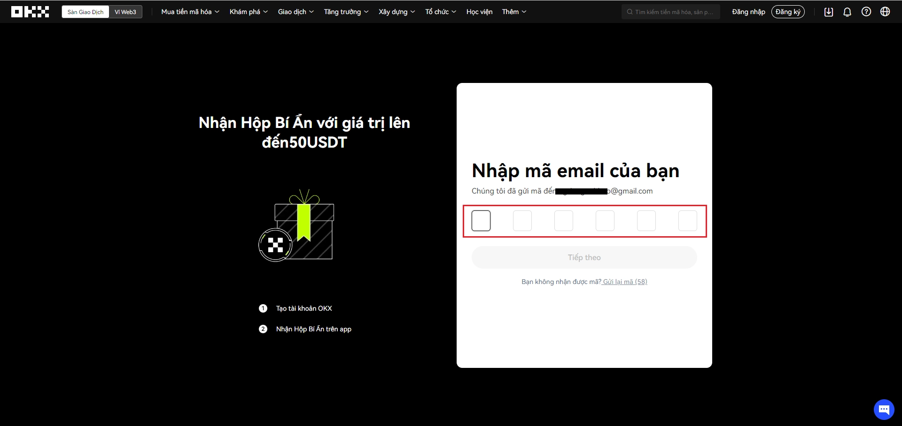
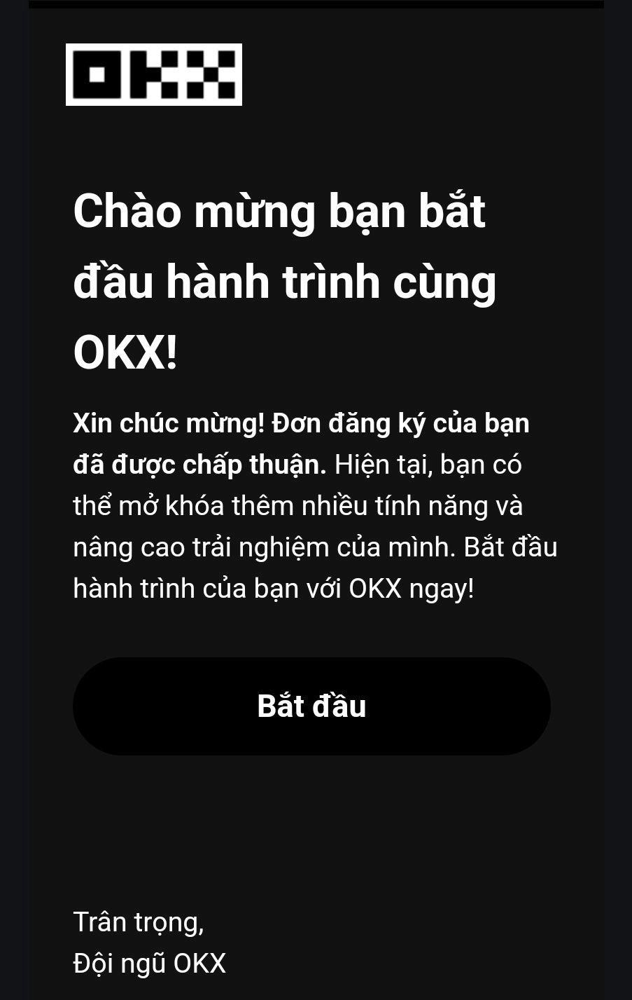

# How to Register an OKX Account: Quick Setup Guide

Opening an OKX account is simpler than most people think. Whether you're new to crypto trading or switching platforms, this guide walks you through the entire registration process—from email verification to document submission. You'll learn exactly what information you need, how to pass identity verification on the first try, and how to start trading within minutes.

---

**Step 1:** Visit the OKX registration page and enter your email address. Click the **SIGN UP** button below the input field.

**Step 2:** Check your inbox for a 6-digit verification code from OKX. Enter this code in the verification field on the registration page.

**Step 3:** Provide your phone number for account verification. Make sure you have access to this number.

**Step 4:** You'll receive an SMS verification code. Enter this code on the OKX registration screen to confirm your phone number.

**Step 5:** Select your country from the dropdown menu, check the box to accept OKX's terms and conditions, then click **NEXT**.

**Step 6:** Create a strong password for your account. Use a combination of uppercase letters, lowercase letters, numbers, and symbols for better security.

👉 [Want trading fee discounts and exclusive rewards? Complete your verification now](https://www.okx.com/join/47044926)

**Step 7:** Click on the user icon in the top menu bar and select **VERIFICATION** from the dropdown options.

**Step 8:** Choose **PERSONAL VERIFICATION** to begin the identity verification process.

**Step 9:** Prepare your identity documents. You'll need a valid government-issued ID for account verification.

**Step 10:** Select one of the accepted document types (passport, national ID card, or driver's license) to proceed with verification.

**Step 11:** Take clear photos of both sides of your chosen document and a selfie. You can do this using the OKX mobile app or your computer's webcam. Make sure the photos are well-lit and all text is readable.

**Step 12:** After submitting your documents, you'll receive an email confirmation once verification is complete. Your account is now ready for trading on OKX.

👉 [Start trading with verified account benefits—use code 47044926 for bonuses](https://www.okx.com/join/47044926)

---

That's the complete walkthrough for creating your OKX account. The platform supports over 250 crypto assets and serves more than 20 million users across 180 markets, making it one of the most trusted exchanges globally. By following these steps, you've set yourself up with a fully verified account that gives you immediate access to spot trading, futures, and other advanced features. Remember to enable two-factor authentication for additional security once you're logged in.
